# Open Connector Description

## Summary

- [Open Connector Description](#open-connector-description)
  - [Summary](#summary)
  - [Introduction](#introduction)
  - [How to create the Open Connector](#how-to-create-the-open-connector)
    - [Prerequisites](#prerequisites)
    - [1. Importing the supplied cloudFaxRestAPI.json file](#1-importing-the-supplied-cloudfaxrestapijson-file)
    - [2. Create an authenticated instance](#2-create-an-authenticated-instance)
    - [3. Create the credentials to access the Open Connector](#3-create-the-credentials-to-access-the-open-connector)
    - [4. Setting up an Open Connector in an Integration Flow](#4-setting-up-an-open-connector-in-an-integration-flow)

## Introduction

Open Connectors allows to automate and simplify the integration of third party solutions with SAP S/4HANA Cloud, providing increased data security and scalability, a unified API layer and standards-based implementation across every environment.

This ensures that developers, integration users, and their use cases are decoupled from the backend services on which they rely.

The Open Connector supplied with this package allows the iFlows in the package to communicate with Retarus Cloud Fax REST API via an authenticated connection over HTTPS.

## How to create the Open Connector

### Prerequisites

- SAP BTP (Business Technology Platform) and Integration Suite:
  - Enabled Integration Suite
  - Enabled Open Connectors capability within the Integration Suite.

- Retarus Cloud Fax:
  - A contract with Retarus for the Cloud Fax service
  - An account at Retarus and the relevant Customer Number
  - Username
  - Password

### 1. Importing the supplied cloudFaxRestAPI.json file

The file available in this package allows the immediated creation of an Open Connector already setup with Retarus Clodu Fax REST API.

1. First of all, download the file from here to your computer: [cloudFaxRestAPI.json](../../src/api-integration/cloudFaxRestAPI.json).

2. Once downloaded, open the Integration Suite in your SAP BTP Tenant, and, in the homepage, scroll down and look for the *Capabilities* area:

    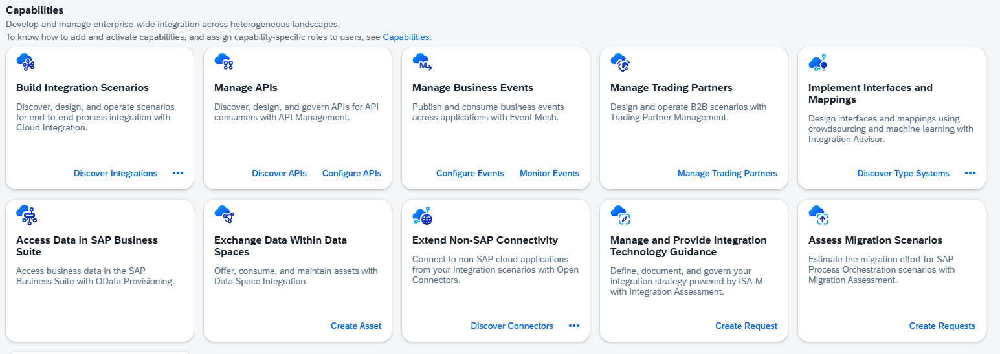

    and check if you have the *Extend Non-SAP Connectivity* option:

    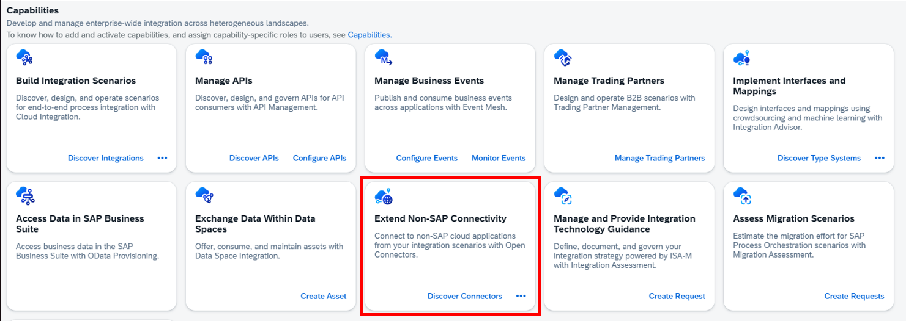

    >*Note: If it is not presente among your capabilities then you either have to add it by clicking on **Manage Capabilities** or you have to check the roles of your account or the entitlements associated to your tenant.*

3. Click on the *Discover Connectorsé link to access the Open Connecto home page:

    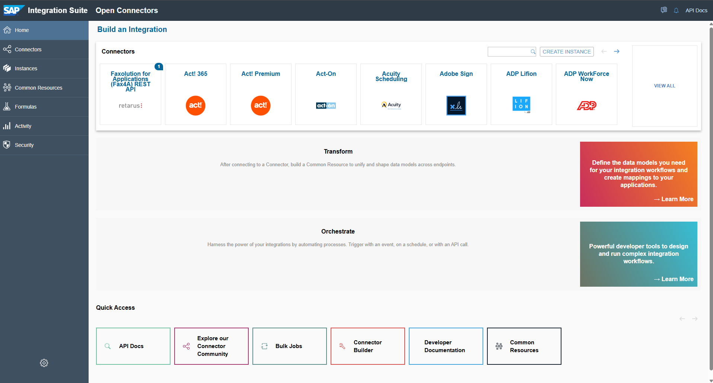

4. Use the link ***Connector Builder*** at the bottom of the page, in the *Quick Access" area, to open the page for importing the *.json* file.

5. In the landing page

    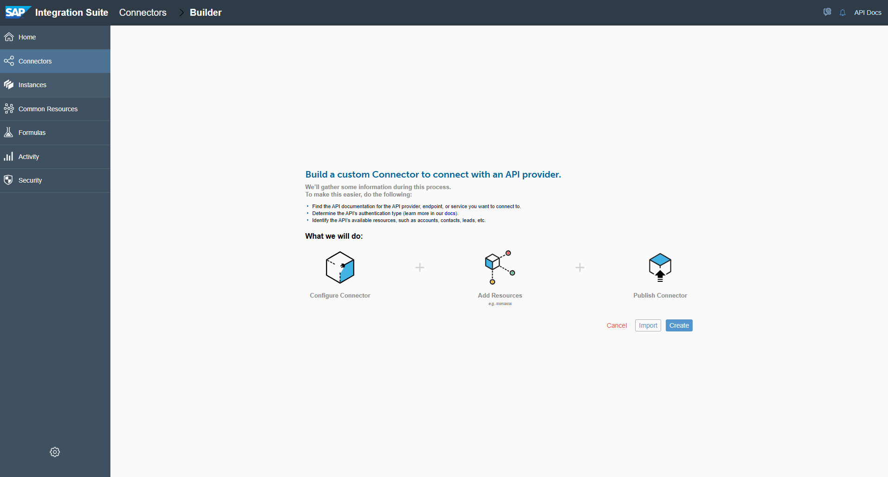

    select *Import* then choose the second option *Swagger - JSON format* and click on *From computer*:

    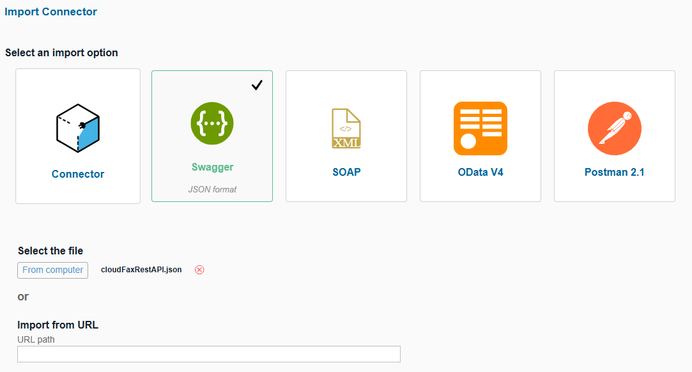

6. Find the file you saved on your pc then, once selected, click on the top right corner button *CONTINUE IMPORT*

7. A menu will appear on the right side of the screen, asking the resources you want to import. Click on *Select All Resources":

    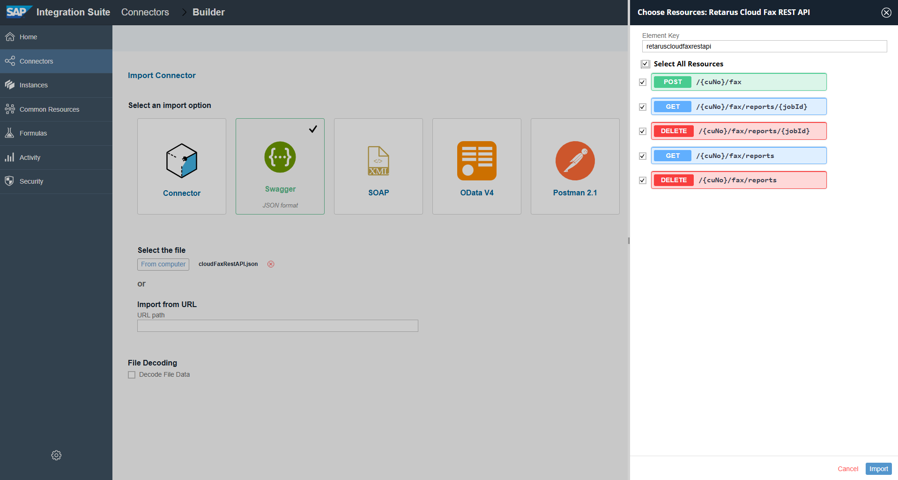

    then click on the button *Import* at the bottom right corner

8. You are now in the *Setup* page of the Open Connector you are creating. Change the *Authentication* type to ***Basic*** anche click *Save* on the top right corner of the page.

9. Congratulations, you have just created your Open Connector to connect to Retarus Cloud Fax Service! Now you only need to create an authenticated instance and you will be ready to use it.

### 2. Create an authenticated instance

You have just created your Open Connector, now you need to create an Autenticated Istance to be able to use it in Integration Flows.

1. Select *Resources* in the menu on the top, to open the page showing the list of all the available API calls:

    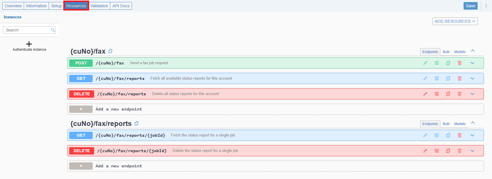

2. Click on the button "+ Authenticate instance" on the left:

    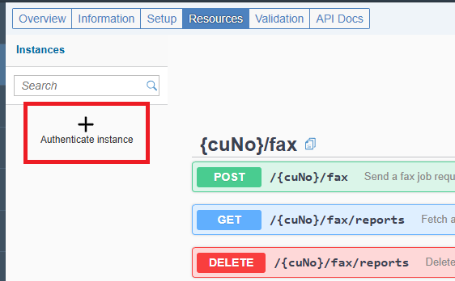

3. In the page that will follow, fill out the field *Name* with to distinguish this istance from others you might need to create in the future. Enter the credentials you received from Retarus in the fields *Username* and *Password* then hit the button *Create Instance* at the bottom right corner of the screen:

    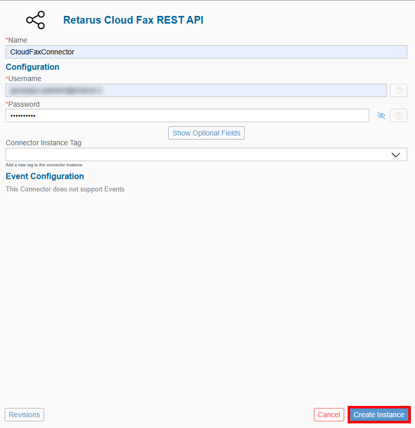

4. If the process was correctly completed, you should see the following screen:

    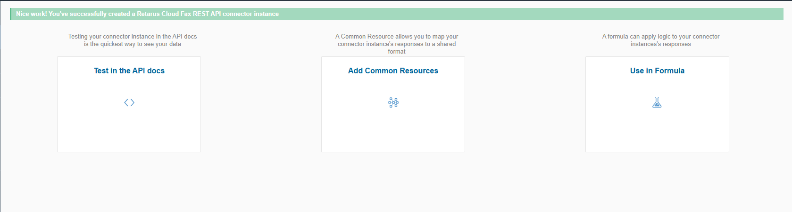

    Click on *Test in the API docs*

5. In the following page

    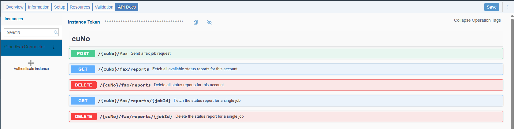

    select the first resource under the section cuNo, that is the POST fax, to expand it

    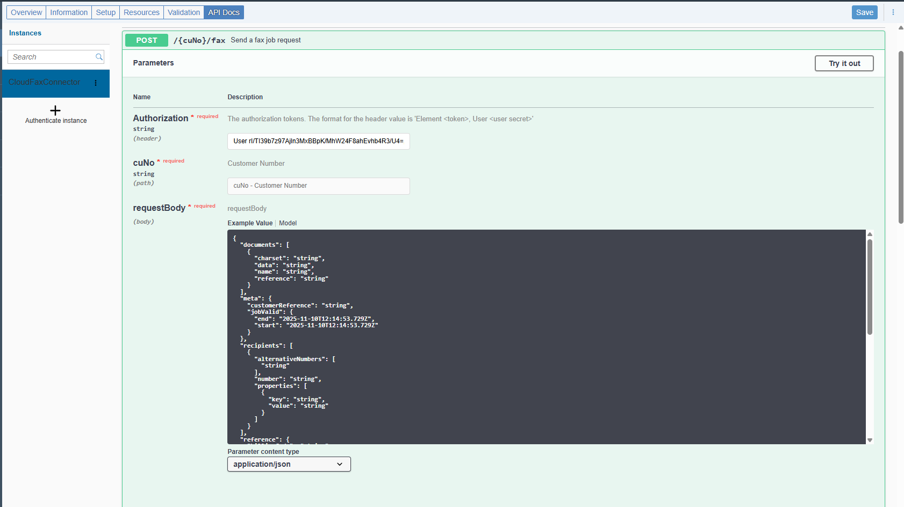

6. Click on *Try it out* on the right

    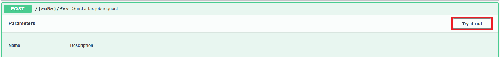

    then enter the Customer Number you received by Retarus in the second field *cuNo*

    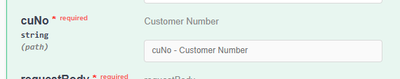

7. Click the *Execute* button below the *requestBody* field:

    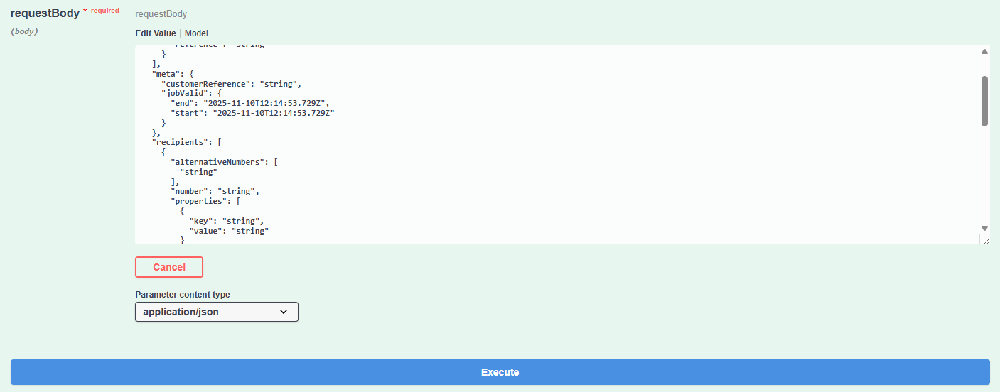

    >*Note: at this stage of the process, it's not important to enter a real and correct request body, we only want to test the connection and retrieve some data out of the call automatically generated by the Open Connector*

8. Scrolling down a bit, you should be able to see the response by the server. It should be a code 400, meaning we have correctly authenticated to the Retarus endpoint but the request body was not properly setup.

    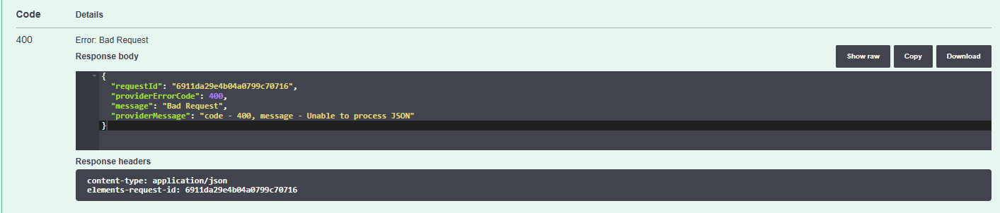

9. What you really need at this stage, is the *Curl* request automatically generated by the system that's right above the response:

    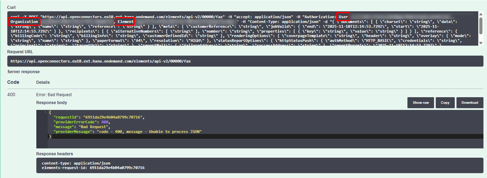

    from here you need to copy the endpoint following *curl -X POST* up to ***/api-v2*** and then the values of ***User***, ***Organization*** and ***Element***. You will need all these data when setting up a connection to the Open Connector inside of iFlows

10. Now the connector instance is in place and can be called from Integration Flows to send/retrieve data to/from the Retarus Cloud Fax service.

### 3. Create the credentials to access the Open Connector

To be able to establish a connection between an iFlos and the Open Connector instance you have just created, you need to create a set of credentials withing the Integration Suite.

1. Go back to the Integration Suite main page and, in the left side menu, select *Monitor => Integrations and APIs*:

    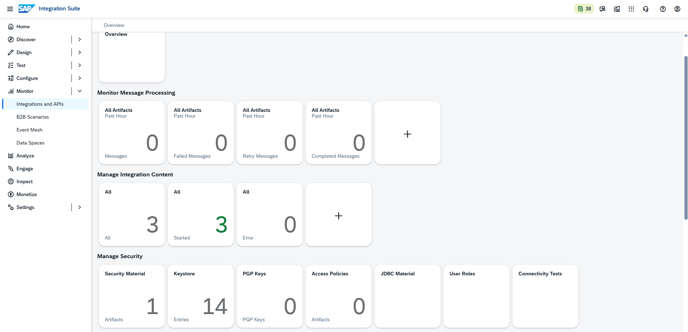

2. Select *Security Material* in section *Manage Security*

    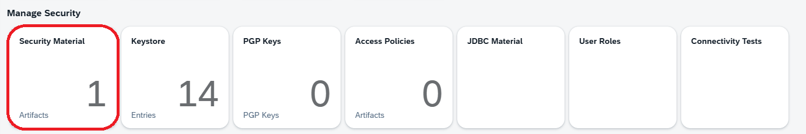

3. Click on *Create* in the menu on the top right header line to open a drop down menu then select *User Credentials*:

    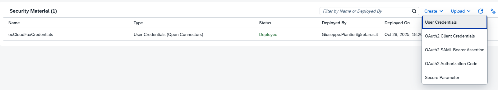

4. Give a name you can easily remember to the set of credentials then, as *Type*, select ***Open Connectors***
5. Use the User, Organization and Element you retrived in the previous chapter to fill in all the mandatory fields:

    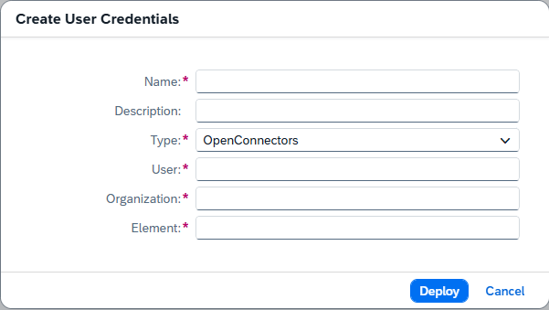

    then click on *Deploy*

6. If you did everything in the correct way, you should now see something like this:

    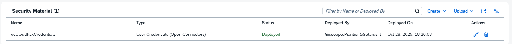

    with the *Status* column saying *Deployed*.

7. The set of credentials has been created and it's ready to be used within an iFlow.

### 4. Setting up an Open Connector in an Integration Flow

In an Integration Flow, when you connect a Send, a Request Reply or an End block to a Receiver block, as *Adapter Type*, you can choose ***OpenConnectors***

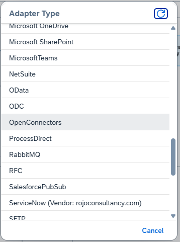

1. Open the settings and switch to the *Connection* tab

    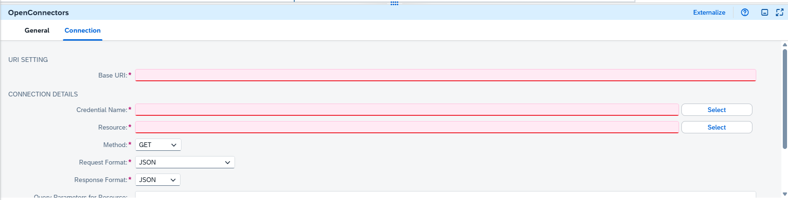

    here you have to fill out the missing fields *Base URI*, *Credential Name* and *Resource*

2. As *Base URI* use the endpoint address you found while [creating the authenticated instance](#2-create-an-authenticated-instance)
    >*Note: remember that the URI ends with /api-v2. what comes next, including the following slash, is added by the chosen resource*
3. As *Credentials Name*, enter the name of the [set of credentials you created before](#3-create-the-credentials-to-access-the-open-connector).
    >*Note: you can also click on the Select button near the field and choose your credentials from the appearing list.*
4. To select the correct *Resource*, click on the relevant *Select* button on the right side of the field. If the previous steps have been correctly completed, a list of resources should appear:

    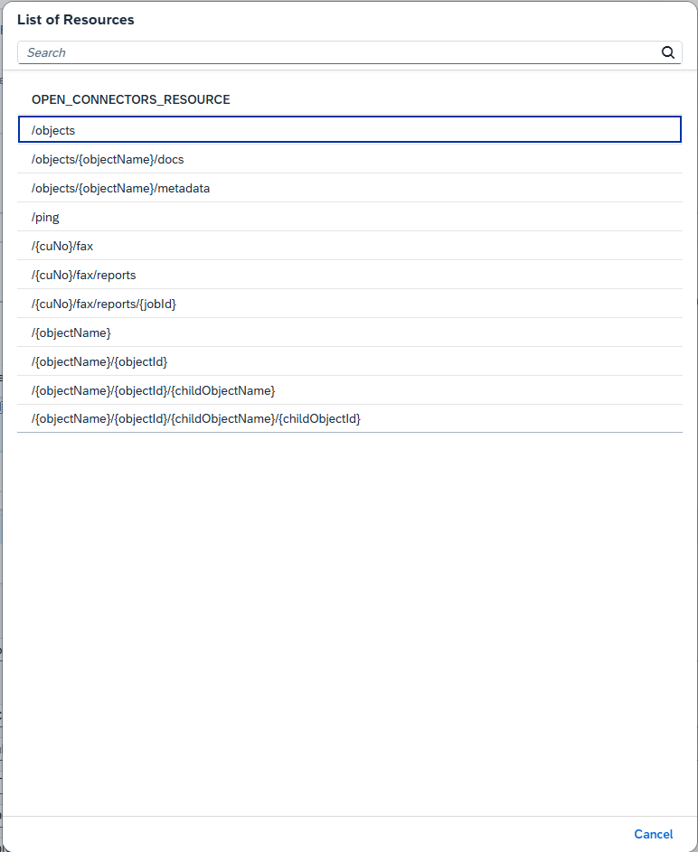

    choose the one you need and the field will be automatically populated.
    >*Note: for the Cloud Fax Connector, the Resources will be like /{cuNo}/fax, or /{cuNo}/fax/reports. You must replace {cuNo} with your Customer Number.*

5. You may now need to set the *Method* to *POST* or to *GET*, depending on the chosen resource
6. The connection to the Open Connector should now be correctly configured ready to be used.
