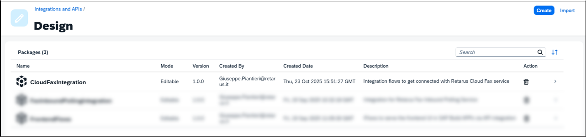
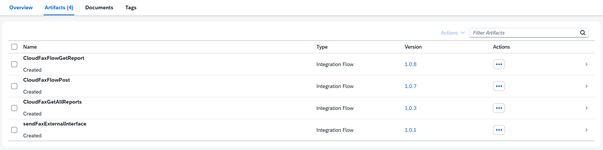
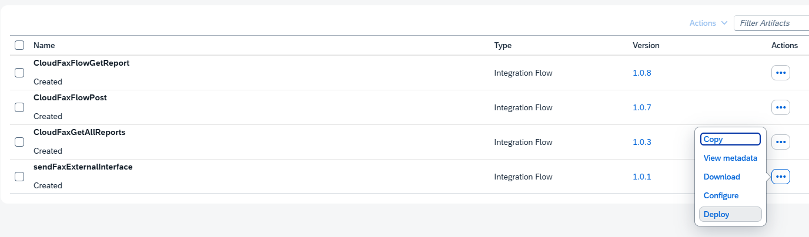
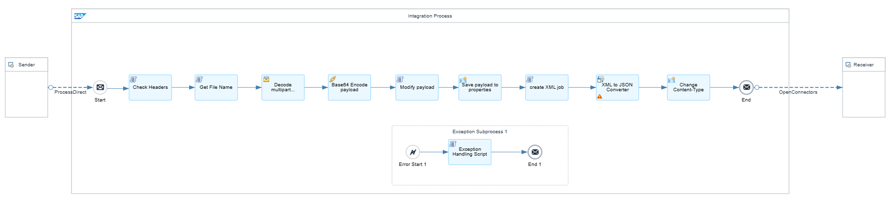
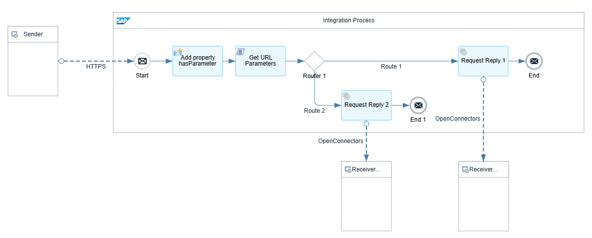
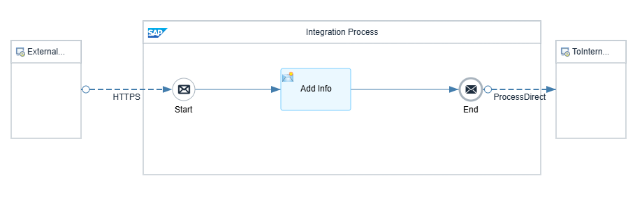
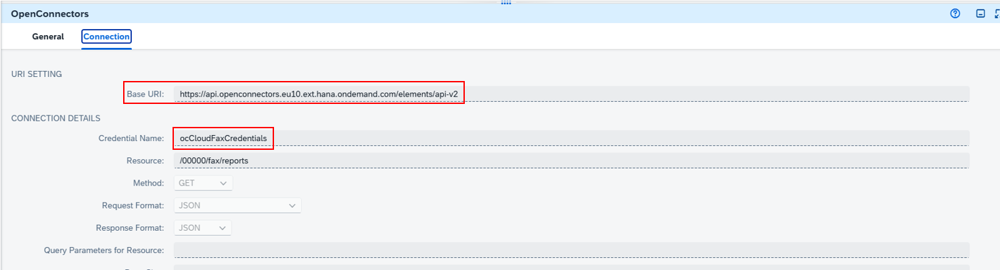

# Integration Package Description

## Summary

- [Integration Package Description](#integration-package-description)
  - [Summary](#summary)
  - [Introduction](#introduction)
  - [How to Install the package](#how-to-install-the-package)
  - [How to Use the iFlows](#how-to-use-the-iflows)
    - [Prerequisites](#prerequisites)
    - [1. CloudFaxFlowPost](#1-cloudfaxflowpost)
      - [1.1. Description](#11-description)
      - [1.2. Input Connection](#12-input-connection)
      - [1.3. Input Payload](#13-input-payload)
      - [1.4. Reply](#14-reply)
    - [2. CloudFaxGetReport](#2-cloudfaxgetreport)
      - [2.1. Description](#21-description)
      - [2.2. Input Connection](#22-input-connection)
      - [2.3. Input Payload](#23-input-payload)
      - [2.4. Reply](#24-reply)
    - [3. sendFaxExternalInterface](#3-sendfaxexternalinterface)
      - [3.1. Description](#31-description)
      - [3.2. Input Connection](#32-input-connection)
      - [3.3. Input Payload](#33-input-payload)
      - [3.4. Reply](#34-reply)
      - [3.5. Output connection](#35-output-connection)
    - [4. Customizing the OpenConnector connections](#4-customizing-the-openconnector-connections)

## Introduction

The *CloudFaxIntegration package* contains the following Integration Flows (iFlows in short):

1. CloudFaxFlowPost
2. CloudFaxGetReport
3. sendFaxExternalInterface

The first 3 iFlows use an Open Connector to communicate and authenticate to Retarus Cloud Fax Service REST API.

## How to Install the package

1. Download to your PC the *.zip* file containing the full Integration package from here: *[CloudfaxIntegration.zip](../../src/integration-flows/CloudFaxIntegration.zip)*
2. Open your Integration Suite in SAP BTP and head to ***Design => Integration and APIs***
3. Select ***Import*** in the top right corner of the screen
4. Select the *.zip* file you just downloaded and confirm

    >If the operation has been correctly excuted, you should see something like this:
    >

5. Click on the package to enter it and select *Artifacts* in the top menu to see the aforementioned iFlows
6. If you see something like this, the package should have been correctly installed:



## How to Use the iFlows

### Prerequisites

- Before being able to use the imported iFlows, they must be deployed first.
The only iFlows that is immediately deplyable is ***sendFaxExternalInterface*** so, click on then relevant 3-dots-icon in che column *Action* and select ***Deploy***: 
    >The others iFlows, instead, require modifications that will be explained here after, one by one, mostly related to the Open Connector.
- If you still haven't created the Open Connector instance connected to Retarus Cloud Faxe,follow this [procedure](../api-integration/README.md) and create one.
- Get the credential name for the Open Connector and the relevant endpoint address (see the mentioned [procedure](../api-integration/README.md))

### 1. CloudFaxFlowPost



#### 1.1. Description

This is the main iFlow of the package. It's meant to receive a *form-data* containing a *.pdf* or a *.tiff* file as a body and some headers, transform it into a *JSON* payload complaiant with the *Retarus Cloud Fax REST API* and use the *Open Connector* to send it to the Reatarus Service.

#### 1.2. Input Connection

This iFlows is meant to be used as part of bigger integrations and it cannot be directly called from a public endpoint: its input connection is a ***ProcessDirect***, the native SAP optimized connection to link iFlows.

It can be called from another iFlow by using the address ***"/postFax"*** in an output ProcessDirect connection.
>About this you can use as example the supplied *sendFaxExternalInterface* iFlow

#### 1.3. Input Payload

The input payload must be a ***multipart/form-data*** message type, with the following features:

- Body: a *.pdf* or *.tiff* file
- Mandatory Headers:
  - Content-Type: multipart/form-data
  - cuno: 12345
    >it's the Customer Number assigned by Retarus
  - csid: faxSender
    >it's the *Called Subscriber IDentification* of the fax
  - destFaxNumber
    >the recipient fax number

Beside these, it's possible to add some optional headers that will be used to populate the coverletter stored in the Retarus account.

Retarus allows Customers to store coverletters in *HTML* format which can include custom placeholders, such as *\$\{FromName\}*, *\$\{FromCompanyName\}*, *\$\{FromFaxNumber\}* or *\$\{ToCompanyName\}*.

These placeholders can be populated when rendering the coverletter, by using the values specified in the optional headers.

The optinal headers must be added in the following way:

```js
- key01: *placeholder1 name*
- value01: *placeholder1 value*
- key02: *placeholder2 name*
- value02: *placeholder2 value*
```

and so on. It is possible to specify up to ***99*** placeholders.

Looking at the exaple placeholders above, we could have:

```js
- key01: FromName
- value01: John Doe
- key02: FromCompanyName
- value02: Acme Inc.
```

and so on.

The final format of the payload could be something like this (in *cURL* format):

```c
curl --location 'SAP-API-ENDPOINT' \
--header 'destFaxNumber: +49123456789' \
--header 'csid: integration tester' \
--header 'key01: FromName' \
--header 'value01: John Doe ' \
--header 'key02: ToName' \
--header 'value02: Jane Doe' \
--header 'key03: SubjectTitle' \
--header 'value03: Cloud fax integration testing' \
--header 'cuno: 12345' \
--header 'Authorization: ••••••' \
--form 'file=@"attachment.pdf"'
```

#### 1.4. Reply

The iFlow will return, in *JSON* format, the ID of the fax job as feedback by Retarus, if the connection has been successfull.

Otherwise, it will return an error message in a different format, based on the kind of error: errors coming from Retarus will be in JSON format, system errors due to SAP could be in different formats (such as HTML).

### 2. CloudFaxGetReport



#### 2.1. Description

This iFlow connects to Retarus Cloud Fax REST API to pull a report in JSON format about the status of the sent jobs.

If no parameter is supplied with the request, it will return a report of all the jobs in waiting.

If the job ID is supplied as request parameter, the iFlow will return only the report for that specific job.

#### 2.2. Input Connection

This iFlow can be directly accessed by a public endpoint (supplied by SAP after the deployment) via a GET request:

- to pull a report of all fax jobs:

```groovy
{{sapBaseUrl}}/http/getReport
```

- to pull a report of a specific fax job:

```groovy
{{sapBaseUrl}}/http/getReport?jobId=F2M5Y4AV6OXDBVXUGHMMKL
```

Where ***{{sapBaseUrl}}*** is the base URI defined by SAP after deployment and can be something similar to:

```groovy
https://integration.name.eu.it-cpi000-rt.cfapps.eu00-000.hana.ondemand.com
```

#### 2.3. Input Payload

No payload is necessary, being a GET request.

#### 2.4. Reply

The reply, in case of a successfull connection, will be a report in *json* format as per Retarus specifications, for instance:

```json
{
  "jobId": "FJJ66GHGX105ZZBIELVCN1",
  "recipientStatus": [
    {
      "number": "+49 89 1234567-8900",
      "properties": null,
      "status": "OK",
      "reason": "OK",
      "sentTs": "2017-08-10T13:05:09Z",
      "durationInSecs": 19,
      "sentToNumber": "00498912345678900",
      "remoteCsid": "+49/89/1234567-8900"
    }
  ],
  "pages": 1,
  "reference": {
    "customerDefinedId": "2017-08-10T13:05:09Z_customerDefinedId",
    "billingCode": "2017-08-10T13:05:09Z_billingCode",
    "billingInfo": "2017-08-10T13:05:09Z_billingInfo"
  }
}
```

For the full specifications, please refer to the [Retarus Report API](https://developers.retarus.com/fax/fax4a-api/fax-reports/getstatusreport).

### 3. sendFaxExternalInterface



#### 3.1. Description

This iFlow is used with the sole scope of providing an interface to ***CloudFaxFlowPost*** to make it reachable from the "outer" world.

It can be used for testing puposes (with postman, for instance) or by any application which is not using iFlows that is, instead, capable of sending *multipart/form-data* via HTTPS.

The ***Add Info*** block is just adding a request property to make the ***CloudFaxFlowPost*** that will follow aware that the request has been sent by an external connection and not through an *OpenDirect* call from another iFlow. It's meant to be used for future developments.

#### 3.2. Input Connection

Input connection is a standard HTTPS POST to an endpoint provided by SAP after the iFlow is deployed.
>Note: at the moment there is no control on the incoming request but as future development there will be a script checking that the request is a POST.

#### 3.3. Input Payload

Same as for ***CloudFaxFlowPost***, see par. [1.3. Input Payload](#13-input-payload)

#### 3.4. Reply

Same as for ***CloudFaxFlowPost***, see par. [1.4. Reply](#14-reply)

#### 3.5. Output connection

This iFlow also features an output ProcessDirect connection that is preconfigured to forward the payload to ***CloudFaxFlowPost***

### 4. Customizing the OpenConnector connections

All the connections using OpenConnectors are already pre-configured but they may need some adjustment, to fit your specific configuration:



- The first parameter you may need to change is the Base URI. Check that the pre-configured one is matching the same that you get when setting up the Open Connector (please refer to the relevant [procedure](../api-integration/README.md#3-create-the-credentials-to-access-the-open-connector))
- The second parameter is the name of the credentials set you have created. If you created a set of credentials matching the preconfigured one, you will not need to change this. Refer to the relevant [documentation](../api-integration/README.md#3-create-the-credentials-to-access-the-open-connector) to setup the credentials for the Open Connector.
